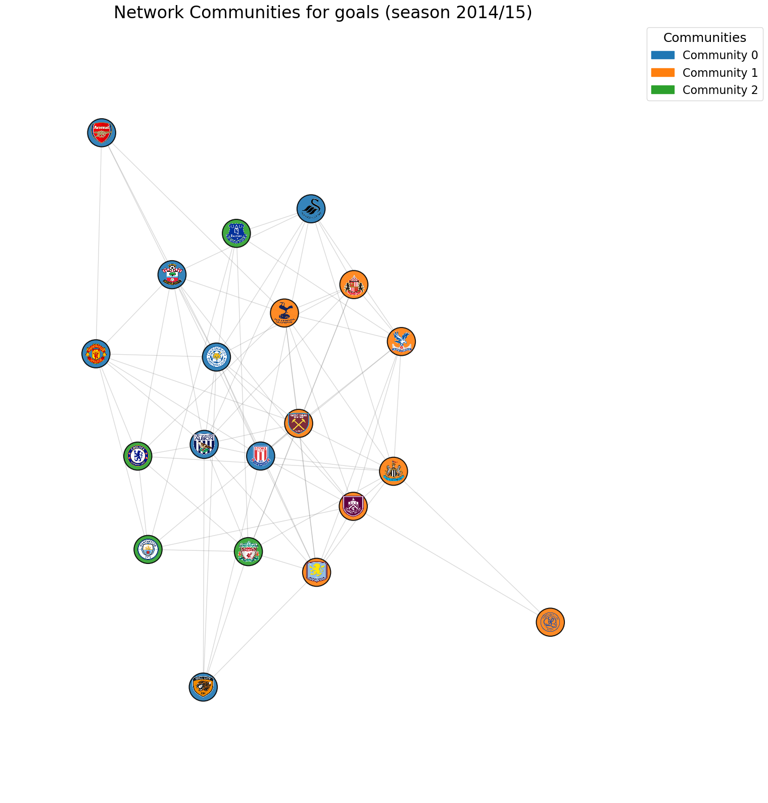
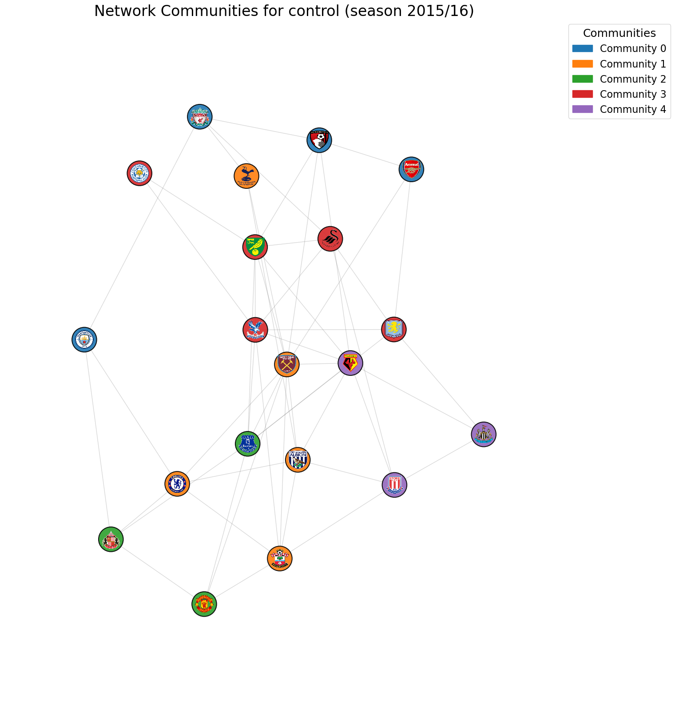
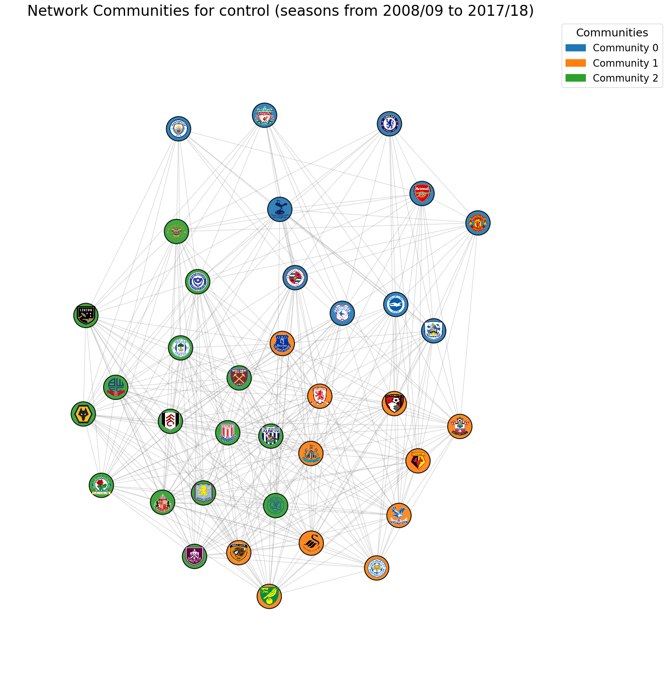
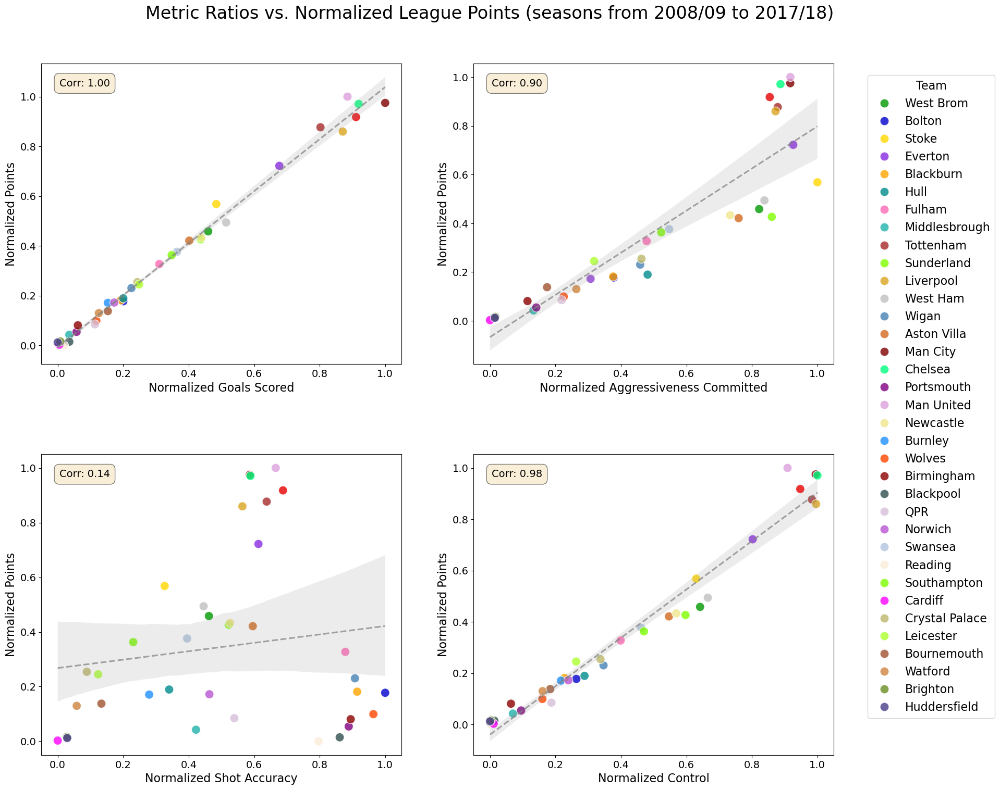

# Premier League Complex Network Analysis

---

## ⚽ Unraveling the EPL's Hidden Dynamics with Network Science

The Premier League isn't just about goals and points; it's a complex web of interactions, rivalries, and underlying tactical battles. This project delves into the rich dataset of English Premier League matches to construct and analyze it as a **complex network**. By applying advanced network science methodologies—including centrality measures, community detection, and correlation analysis—the aim is to uncover the unseen structural relationships that define team performance, strategic interactions, and league dynamics.

---

## 🔍 Key Features

* **Dynamic Network Creation**: Build a directed graph representing inter-team relationships (e.g., goals scored/conceded, aggression, control) based on match data over customisable seasons or specific campaigns.
* **Comprehensive Centrality Analysis**: Calculate and interpret various centrality measures (In-Degree, Out-Degree, In-Strength, Out-Strength, Betweenness, Closeness, Eigenvector) to identify the most influential, central, or pivotal teams across different metrics.
* **Correlation with League Performance**: Quantify the statistical relationship between a team's network centrality (across various metrics) and its final league points, revealing which aspects of team interaction are most tied to success.
* **Community Detection**: Employ the Louvain algorithm to uncover natural groupings (communities) of teams based on their shared interaction patterns (e.g., teams that engage in similar levels of aggression or control when playing each other).
* **Metric-Specific Filtering**: Apply dynamic thresholds to filter network edges, focusing analysis on significant interactions for specific metrics (e.g., only highly aggressive encounters, or matches with similar control levels).
* **Visualizations**: Generate insightful plots to visualize network structures, centrality distributions, and correlations, making complex data easily digestible.

---

## 📈 Key Insights from This Analysis

This study reveals fascinating patterns when analyzing the EPL through a network lens, both in specific seasons and over a decade:

* **Fragmented Dominance (2014/15 & 2015/16):** Despite the "Big Six" clubs often topping the league, they rarely form a single, cohesive community in the similarity networks for goals, aggressiveness, or control. This suggests their dominance isn't based on identical playing styles, but rather diverse approaches.

    For instance, in the 2014/15 season, top teams were dispersed even in 'goals' similarity networks, indicating varied scoring profiles:
    

* **Leicester's Anomaly (2015/16):** Leicester City's title win was unique. While they didn't consistently show high centralities across all metrics in the network, their success highlighted how being "similar" in aggression could suddenly correlate positively with league points, suggesting a shift in what constituted a winning tactical approach that season. Their distinct 'control' profile is evident:
    

* **Long-Term Trends (2008/09 - 2017/18):** Over a decade, the "Big Six" tend to cluster more in terms of **control similarity**, indicating that consistent offensive pressure and ball dominance are defining characteristics of long-term strength. Intriguingly, while similarity in goals and control often correlates negatively with points (meaning true dominance comes from creating *differences*), being consistently "similar" in **aggressiveness** (i.e., balanced, pragmatic aggression) surprisingly correlates *positively* with long-term success. This implies that successful teams maintain a strategic, consistent level of aggression that allows for competitive matches without excessive fouls or cards. The long-term 'control' communities demonstrate this clearer grouping:
    

    Overall correlations between network metrics and league points across seasons also highlight these trends:
    

* **Persistent Patterns:** Mid-to-lower table teams often exhibit high centralities in 'goals' and 'control' networks, indicating their frequent involvement in tightly contested matches in these areas, but this generally doesn't translate to higher league standing.

---

## 🛠️ Technologies & Libraries

* **Python**: The core programming language for data processing and network analysis.
* **Pandas**: Essential for data manipulation and preparation of match datasets.
* **NetworkX**: The powerful library for creating, manipulating, and studying the structure, dynamics, and functions of complex networks.
* **`python-louvain`**: For efficient and effective community detection using the Louvain algorithm.
* **SciPy**: For statistical computations, particularly Pearson correlation.
* **Matplotlib / Seaborn**: For creating compelling data visualizations.

---

## 🚀 Getting Started

To explore the Premier League as a complex network, follow these steps:

1.  **Clone the Repository**:

    ```bash
    git clone [https://github.com/marcellorussox/premier-league-complex-net.git](https://github.com/marcellorussox/premier-league-complex-net.git)
    cd premier-league-complex-net
    ```

2.  **Set Up Your Environment**:
    It's highly recommended to use a virtual environment.

    ```bash
    python -m venv venv
    source venv/bin/activate  # On Windows: `venv\Scripts\activate`
    ```

3.  **Install Dependencies**:

    ```bash
    pip install -r requirements.txt
    ```

4.  **Prepare Your Data**:
    This project expects a Premier League match dataset. Place your `epl_final.csv` file in the `data/raw/` directory.

5.  **Run the Analysis**:
    The main analysis pipeline is typically run via `src/pipeline.py`.

    ```bash
    python src/pipeline.py
    ```

---

## 📊 Project Structure

```
premier-league-complex-net/
├── data/
│   ├── epl_logos/             # Contains EPL team logos (e.g., for visualizations)
│   └── raw/
│       └── epl_final.csv      # Raw Premier League match data
├── notebooks/
│   └── analysis.ipynb         # Jupyter notebook for exploration and detailed analysis
├── plots/
│   ├── 2008_18_control_com.png # Example plot: Control communities for 2008-2018
│   ├── 2014_15_goals_com.png   # Example plot: Goals communities for 2014-15
│   ├── 2015_16_control_com.png # Example plot: Control communities for 2015-16
│   └── metrics_points.png      # Example plot: Metrics vs. Points correlations
├── src/
│   ├── __init__.py
│   ├── data_utils.py          # Utilities for data loading and preprocessing
│   ├── graph_utils.py         # Functions for graph creation, filtering, and analysis
│   └── pipeline.py            # Orchestrates the main analysis workflow
├── .gitignore
├── LICENSE
└── README.md
```

---

## 💡 How It Works (Under the Hood)

1.  **Data Ingestion & Preprocessing**: Raw match data (e.g., team names, goals, fouls, possession) from `data/raw/epl_final.csv` is loaded and cleaned using `data_utils.py`. Metrics like 'aggressiveness' (fouls + yellow cards + red cards), 'control' (possession), and 'shot accuracy' are calculated.
2.  **Network Construction**: A **directed graph (`networkx.DiGraph`)** is built where nodes represent Premier League teams. Edges `A -> B` represent interactions aggregated over matches where Team A played against Team B. Edge attributes store calculated metrics (e.g., `goals_for_A_vs_B`, `aggressiveness_A_vs_B`). Crucially, normalized difference metrics (e.g., `aggressiveness_diff_norm_abs`) are computed to quantify the *similarity* or *dissimilarity* of teams' performance across a specific metric when they interact. This is primarily handled in `graph_utils.py`.
3.  **Filtering for Analysis**: For each specific metric (e.g., 'aggressiveness'), a **filtered directed graph** is created. Only edges where the `_diff_norm_abs` for that metric falls within a specified threshold are retained. This ensures that centrality and community analysis focuses on meaningful and comparable interactions. Logic for this is within `graph_utils.py`.
4.  **Centrality Measures**: Various centrality algorithms are applied to the *filtered directed graph* to understand team importance based on different network perspectives, found in `graph_utils.py`.
5.  **Community Detection**: The *filtered directed graph* is then converted into an **undirected graph**. For community detection, edge weights are often transformed to represent *similarity* (e.g., `1 - _diff_norm_abs`), where higher values indicate stronger ties, encouraging Louvain to group highly similar teams together. This functionality is also within `graph_utils.py`.
6.  **Correlation Analysis**: The calculated centrality scores for each team are correlated with their total league points for the season. This provides quantitative insights into which network positions or interaction styles contribute most to league success, likely implemented in `graph_utils.py` or `pipeline.py`.

---

## 🤝 Contributing

Contributions are what make the open-source community such an amazing place to learn, inspire, and create. Any contributions you make are **greatly appreciated**.

If you have a suggestion that would make this better, please fork the repo and create a pull request. Don't forget to give the project a star! Thanks!

1.  Fork the Project
2.  Create your Feature Branch (`git checkout -b feature/AmazingFeature`)
3.  Commit your Changes (`git commit -m 'Add some AmazingFeature'`)
4.  Push to the Branch (`git push origin feature/AmazingFeature`)
5.  Open a Pull Request

---

## 📄 License

Distributed under the MIT License. See `LICENSE` for more information.

---
